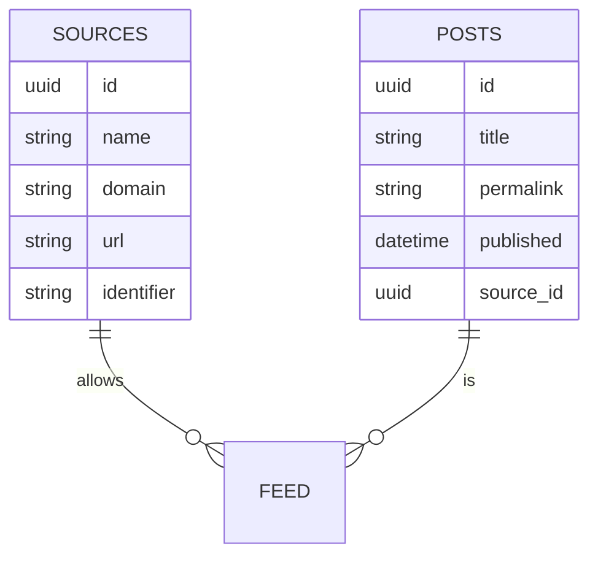

## Recreate a Migration

>Remove the existing files from the Migrations folder

>execute the following command - cd into the database project folder
dotnet ef  migrations add initial
>
> 

### Entity Relationship Diagram
